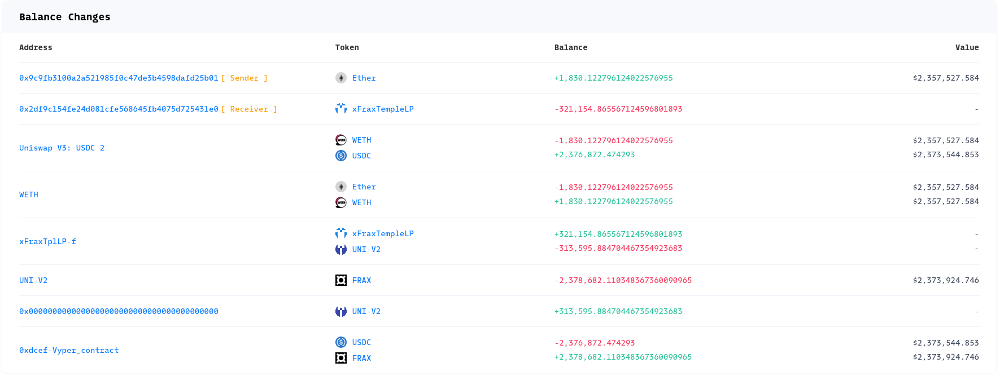
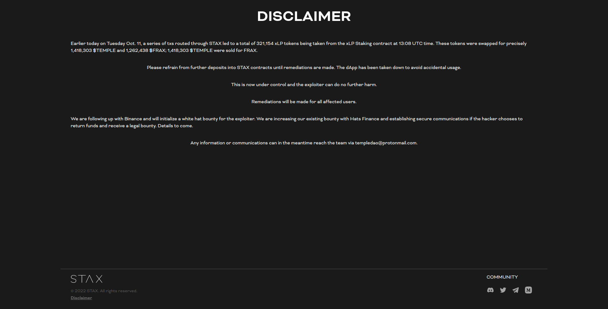

# Analysis of the TempleDAO exploit 

The exploited StaxLPStaking contract on etherscan: [0xd2869042E12a3506100af1D192b5b04D65137941](https://etherscan.io/address/0xd2869042e12a3506100af1d192b5b04d65137941#code)  
The exploit transaction hash: [0x8c3f442fc6d640a6ff3ea0b12be64f1d4609ea94edd2966f42c01cd9bdcf04b5](https://etherscan.io/tx/0x8c3f442fc6d640a6ff3ea0b12be64f1d4609ea94edd2966f42c01cd9bdcf04b5)  
The transaction hash with the swaps: [0x4b119a4f4ba1ad483e9851973719f310527b43f3fcc827b6d52db9f4c1ddb6a2](https://etherscan.io/tx/0x4b119a4f4ba1ad483e9851973719f310527b43f3fcc827b6d52db9f4c1ddb6a2)  

The hacker address: [0x9c9Fb3100A2a521985F0c47DE3B4598dafD25B01](https://etherscan.io/address/0x9c9fb3100a2a521985f0c47de3b4598dafd25b01)  
The Exploit contract: [0x2Df9c154fe24D081cfE568645Fb4075d725431e0](https://etherscan.io/address/0x2df9c154fe24d081cfe568645fb4075d725431e0)  
Hacker exit address: [0x2B63d4A3b2DB8AcBb2671ea7B16993077F1DB5A0](https://etherscan.io/address/0x2b63d4a3b2db8acbb2671ea7b16993077f1db5a0)

## The vulnerability: Access control 

Poor access control on the `migrateStake()` function of StaxLPStaking:

```solidity
    /**
     * @notice For migrations to a new staking contract:
     *         1. User/DApp checks if the user has a balance in the `oldStakingContract`
     *         2. If yes, user calls this function `newStakingContract.migrateStake(oldStakingContract, balance)`
     *         3. Staking balances are migrated to the new contract, user will start to earn rewards in the new contract.
     *         4. Any claimable rewards in the old contract are sent directly to the user's wallet.
     * @param oldStaking The old staking contract funds are being migrated from.
     * @param amount The amount to migrate - generally this would be the staker's balance
     */
function migrateStake(address oldStaking, uint256 amount) external {
    StaxLPStaking(oldStaking).migrateWithdraw(msg.sender, amount); //exploit
    _applyStake(msg.sender, amount);
}
```

This function allows **anyone** (missing modifier) to submit **any address** (missing check) as the `oldStaking` parameter.

The first line call `migrateWithdraw` on the *supplied address*, anyone can choose what this functin does (eg nothing at all), and the second line increase the msg.sender's balance on the contract, since the contract thinks that the msg.sender had something staked that was just migrate:
```solidity
function _applyStake(address _for, uint256 _amount) internal updateReward(_for) {
    _totalSupply += _amount;
    _balances[_for] += _amount;
    emit Staked(_for, _amount);
}
```

Once this is done, we can just call `withdrawAll()` which will transfer the given amount of LP tokens to our msg.sender address.


## The exploit

The hacker did exactly that, he deployed a dummy oldStaking contract and called `migrateStake(dummy_oldStking, xFraxTempleLP.balanceOf(StaxLPStaking))` and then `withdrawAll(false)`. He submitted his transaction to the flashbot rpc to avoid frontrunners, and ended up with 321,154 [xFraxTempleLP](0xBcB8b7FC9197fEDa75C101fA69d3211b5a30dCD9) worth over $2MM. 

Overall, this was a fairly simple exploit.


Once the hacker receive the 321,154 LP token, he does several swap to end up with 1,830 ETH worth around $2,350,000 which he sent to tornado cash.




The hacker through a first address:
- funded its EOA through finance (1)
- deployed a dummy contract at 0x9bdb04493aF17eB318A23BfeFe43f07b3E58EcFb (2) (later used as the address for `oldStaking`)
- deployed the attack contract at 0x2Df9c154fe24D081cfE568645Fb4075d725431e0 (3)  


And a second address:
- exploited the stacking contract (4)
- swaped his newly gain LP token for ETH (5)
- sent the ETH to a third exit address 0x2B63d4A3b2DB8AcBb2671ea7B16993077F1DB5A0 (6)


- which sent 1,813 ETH to tornado cash (7)


## Conclusion


Since the exploit, the Stax.fi website has been taken down:


